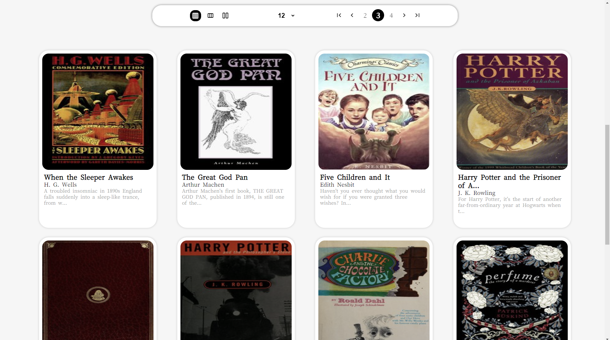

# BookSearch

Una libreria per Te!

[](https://booksearch-rliciotti.netlify.app/)
[](https://github.com/r-liciotti/BookSearch)

## Cos'è BookSearch?

**BookSearch** è una piattaforma online che consente di cercare libri utilizzando le API di OpenLibrary. Offre una ricerca facile e veloce di libri basata su dati esterni.

## Funzionalità

### Cerca
Inserisci il titolo, l'autore o il genere nel campo di ricerca per trovare i libri di tuo interesse.


### Trova
La barra di ricerca accetta vari criteri per una maggiore precisione. Una volta effettuata la ricerca, il sito mostra i risultati con informazioni di base sul libro, come il titolo, l'autore e altri dettagli essenziali.



### Apri il Libro
Cliccando su un libro, si aprono ulteriori dettagli come descrizioni e altre informazioni.


### Link to Wiki
L'integrazione con Wikipedia offre una fonte di informazioni aggiuntive sui libri trovati.


## Tecnologie Utilizzate

- **HTML**
- **CSS**
- **JavaScript**
- **WebPack**
- **Axios**

## Installazione

Per installare e avviare il progetto in locale, segui questi passaggi:

1. Clona il repository:
    ```sh
    git clone https://github.com/r-liciotti/BookSearch.git
    ```
2. Vai nella directory del progetto:
    ```sh
    cd BookSearch
    ```
3. Installa le dipendenze:
    ```sh
    npm install
    ```
4. Avvia il progetto:
    ```sh
    npm start
    ```

## Contribuire

Contributi, segnalazioni di bug e richieste di funzionalità sono benvenuti! Per contribuire, per favore segui questi passaggi:

1. Fai un fork del progetto
2. Crea un branch per la tua funzionalità (git checkout -b feature/AmazingFeature)
3. Fai il commit delle tue modifiche (git commit -m 'Add some AmazingFeature')
4. Fai il push al branch (git push origin feature/AmazingFeature)
5. Apri una Pull Request

## Licenza

Distribuito sotto la licenza MIT. Vedi `LICENSE` per maggiori informazioni.

## Contatti

R-Liciotti - [GitHub](https://github.com/r-liciotti/BookSearch)

Prova la demo: [BookSearch](https://booksearch-rliciotti.netlify.app/)
